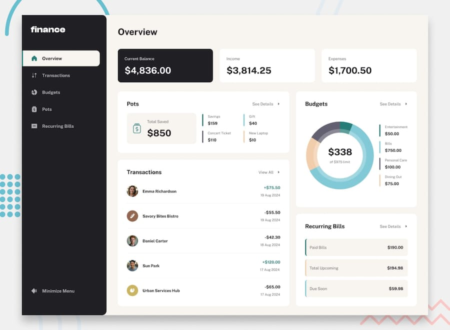

# 💰 Finance Tracker - full-stack application

A modern, responsive personal finance application designed to help you track transactions, manage budgets, and save for your goals.



# 🛠️ Tech Stack
This project is built with a modern full-stack architecture, fully containerized for easy setup and deployment.
### Frontend: 
- Framework: React with Vite
- Language: TypeScript
- State management: Zustand
- Data fetching & caching: TanStack React Query
- Routing: React Router
- Styling: SCSS
- Charting: Recharts
- Linting: ESLint

### Backend (REST API):
- Framework: Symfony 6+
- Language: PHP 8+
- Database: MySQL managed via Doctrine ORM
- Auth: LexikJWTAuthenticationBundle for access tokens and GesdinetJWTRefreshTokenBundle for refresh tokens
  
# 🚀 Getting Started
1. Clone the project to your local machine
2. Copy and edit placeholders inside
 ````
 cp .env.sample .env
 ```` 
3. Set DATABASE_URL and APP_SECRET by creating /api/.env.local
 ```
 DATABASE_URL = mysql://${MYSQL_USER}:${MYSQL_PASSWORD}@db:3306/${MYSQL_DATABASE}?serverVersion=8.0&charset=utf8mb4 (copy values from root .env)
 APP_SECRET = generate using - openssl rand -hex 32
 ```
4. Build project
  ```
 docker-compose up -d --build
  ```
5. Install frontend/backend dependencies
  ```
 docker-compose exec api composer install
 docker-compose exec frontend npm install
  ```
6. Generate JWT key pair
```
docker-compose run --rm api php bin/console lexik:jwt:generate-keypair
```

7. Migrate database
```
docker-compose exec api php bin/console doctrine:migrations:migrate
```
8. You are good to go! Open [localhost](http://localhost/)
